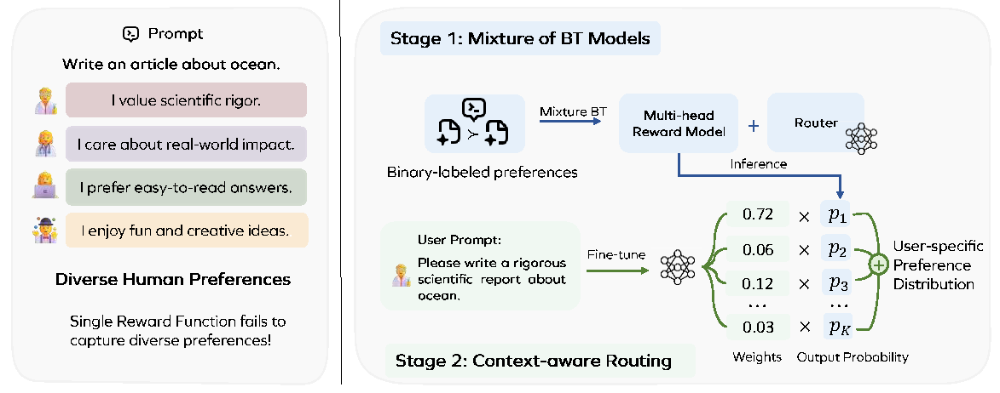

# 🚀 MiCRo: Mixture Modeling and Context-aware Routing for Personalized Preference Learning

Official Implementation of "MiCRo: Mixture Modeling and Context-aware Routing for Personalized Preference Learning".



## 📦 Environments Setup
```bash
conda create -n micro python=3.10
conda activate micro
pip install -r requirements.txt
```

## 💻 Experiments
1. Create datasets.
```bash
cd data_process/
python create_pair_wise_data.py
```
2. Start the training
```bash
bash run.sh
```
